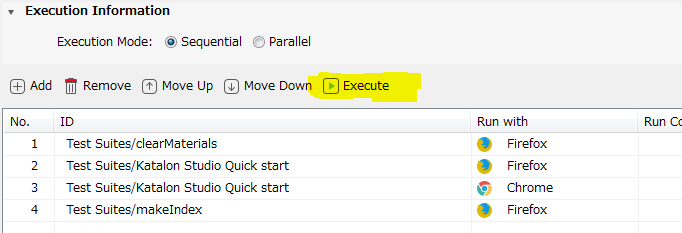
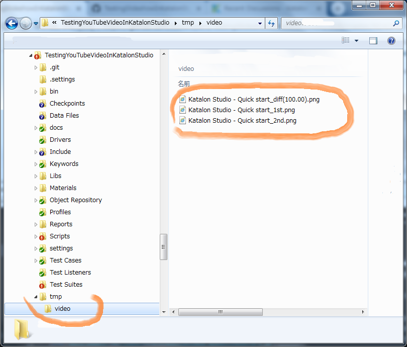
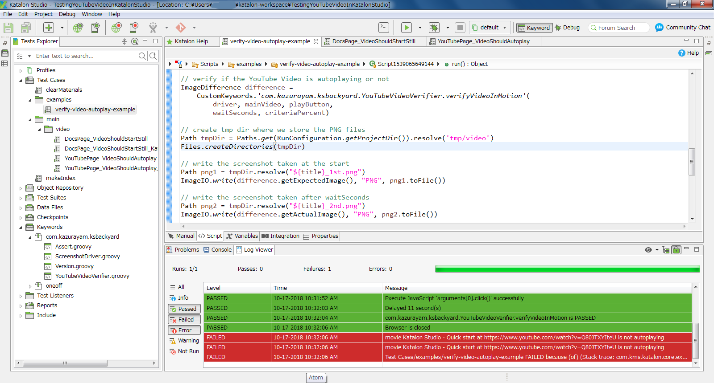

Testing WebElement in motion in Katalon Studio
=====

## What is this?

This is a [Katalon Studio](https://www.katalon.com/) project for demonstration purpose. You can clone this out to your PC and execute in Katalon Studio.

This project was developed using Katalon Studio 5.7.1.

This project was developed to propose solutions to the following 2 discussions posted in the [Katalon Forum](https://forum.katalon.com/discussions) : [Not able to verify whether a youtube video is working properly or not.](https://forum.katalon.com/discussion/9904/not-able-to-verify-whether-a-youtube-video-is-working-properly-or-not).
The original question was as follows:
>How to verify whether a youtube video is working properly or not. My scenario is to click on any video which in turn opens in a pop up. Then play the video to verify whether its playing or not and then click on pause button to verify whether it stops or not. And then close the video pop up.

## Problems to solve

You can make a web page which embeds a YouTube video. YouTube video itself is usually marked up with video element like this:
```
<video src="https://www.youtube.com/watch?v=Q80JTXYIteU">
```

And the page is expected to have a start/stop button like this:
```
<button class="ytp-play-button ytp-button" aria-label=Play>
    ...
</button>
```

When a web page with embeded video loaded, the video may autoplay on load or stay still. It depends on how the page is designed and configured. I want to verify if the video element autoplays as expected, or it stays still as designed. I want to do the verification in Katalon Studio.

## Solution proposed

[aShot](https://github.com/yandex-qatools/ashot), WebDriver Screenshot utility, enables you to take a screenshot of a selected WebElement (e.g. <video">). Also aShot enables you to compare 2 images and know how much different they are. This Katalon Studio project uses aShot. This project provides a set of Custom Keywords in Katalon Studio, which wrap the aShot API. Also the project provides some example Test Cases in Katalon Studio which shows how to make use of the keywords.

You will realize another problem. If you take screen shots, you would inevitably want to save images into files on your local disk. But how you manage the paths of generated files? It is a cumbersome problem. My [Materials](https://github.com/kazurayam/Materials) project provides a smart solution for managing & resolving paths of image files dynamically created by test cases on Katalon Studio.

## Demonstration

### Input

The demo will open the following URL. Both embeds the same video clip: 'Kataln Studio - Quick start'.

1. [YouTube: Katalon Quick start](https://www.youtube.com/watch?v=Q80JTXYIteU)
2. [Katalon Docs: Quick start](https://docs.katalon.com/katalon-studio/tutorials/quick_start.html)

### How to run the demo

1. download the source ZIP file of this demo project from the [releases](https://github.com/kazurayam/TestingYouTubeVideoInKatalonStudio/releases) Page (version 0.4 or higher)
2. unzip it
3. start your Katalon Studio, open the `TestingYouTubeVideoInKatalonStudio` project.
4. open `Test Cases/examples/vefiry-video-autoplay-example` and run it. You can use either of Firefox or Chrome.
5. Or you open a Test Suite Collection named `Test Suites/Execute vefiry vidoes`, and run it by clicking the `Execute` button 

### Output

Running `Test Cases/examples/vefiry-video-autoplay-example` will result `<project folder>/tmp/video` directory.


In the folder you would find 3 image files.
- Katalon Studio - Quick start_1st.png  [1st](docs/images/tmp/video/Katalon%20Studio%20-%20Quick%20start_1st.png)
- Katalon Studio - Quick start_2nd.png  [2nd](docs/images/tmp/video/Katalon%20Studio%20-%20Quick%20start_2nd.png)
- Katalon Studio - Quick start_diff(100.00) [diff](docs/images/tmp/video/Katalon%20Studio%20-%20Quick%20diff%28100.00%29.png)


## What happens? when you encounter a real YouTube trouble

At 10:30AM 17,Oct 2018 JST, I encountered a real YouTube trouble.
When I requested https://www.youtube.com/watch?v=Q80JTXYIteU with browser, the page was responed. But the video in the page was black and
showed a message 'sorry for inconvenience'. Wow! What a good chance to evaluate my study I got.

I ran the `Test Cases/verify-video-autoplay-example`. The test case failed AS EXPECTED.


The test case emitted an ImageDiff as follows:


This incident proved, just accidentally, that my approach of *verifying YouTube video autoplay or not* is capable of detecting actual YoutTube problems when they happen.

## Conclusion

What have I learned by the experiment? I learned that verifying video is a complicated task. My study is poor. My Custom Keywords are short for supporting the complexities of video.

I would not go on this issue anymore.
